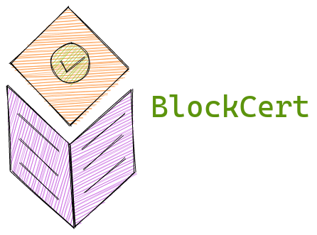

# BlockCert : Internship Project


**Blockchain based digital certificates for PDFs and other documents.**

## How it works

The first step would be to connecting to existing peer-to-peer nodes on the internet set up by IPFS. These are called Bootstrap nodes and we will be using these to get the addresses of the other nodes in our blockchain network.

After connecting to the bootstrap nodes, we get a list of peers that are connected to the blockchain network that we want to connect to. This is how all the nodes get connected to each other.

If you want to generate a certificate, you need a Private RSA Key along with a Public RSA Key to allow others to verify your signatures. Whenever you add a certificate while connected to your node, metadata, including the hash of your file, as well as the private key, are sent to all the nodes.

All these nodes compete to find the a randomised pattern while calculating the hash value for the block. This is called **mining**. While mining, they generate a number called Proof Of Work. Basically, the higher the proof of work, the more work done by the computer mining the data.

When a node finishes, it broadcasts it's chain on the network so other nodes can check the data. The largest valid chain in the network is considered to be the the correct one. In case there are conflicts, the chains are compared. The chain with the largest proof of work is considered to be the winning chain.

## Build
### Build using Go Compiler
```
$ go build blockcert.go
```
#### Install 
```
$ go install
```
Make sure you have an accessible `GOPATH`.
### Build using Docker
```
$ docker build ./ -t <imagename>:<tagname>
```
#### Running the docker image
**From Dockerhub**
```
$ docker run --rm -it -p <local_port>:8080 -v <path>:/data panzerox123/blockcert
```
**If you want to use your own image**
```
$ docker run --rm -it -p <local_port>:8080 -v <path>:/data <imagename>:<tagname>
```

## Usage
### Generating a Key Pair
```
$ blockcert -k keygen -o <filename>
```

Generates a keypair. Store this safely. The Private key will be used to generate your certificates, users can use the public key to verify the certificate.
Default file is `certificate.key`.

### Starting blockcert (Start node along with a front-end server)
```
$ blockcert
```
Starts a blockcert node on your system along with a front-end server for the GUI. 

*TODO: API Documentation*

### Starting a blockcert debug shell(For testing functionality)

```
$ blockcert -debug
```

#### Blockcert shell commands
- `addcert <filename> <private_key>`

    Create a certificate for a file
- `verifyallcert`

    Verify the blockchain
- `checkcert <filename> <public_key>`

    Check the certificate for a particular file
- `showallcerts`

    Display blockchain info
- `peers`

    List all peers
- `keygen <filename_optional>`
    
    Generate a keypair
- `discover`

    Run peer discovery function